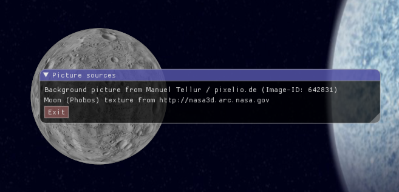
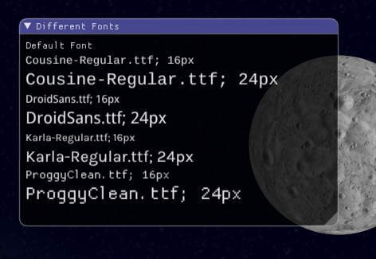
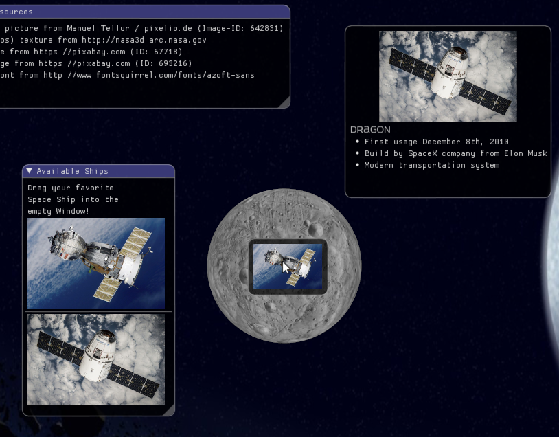
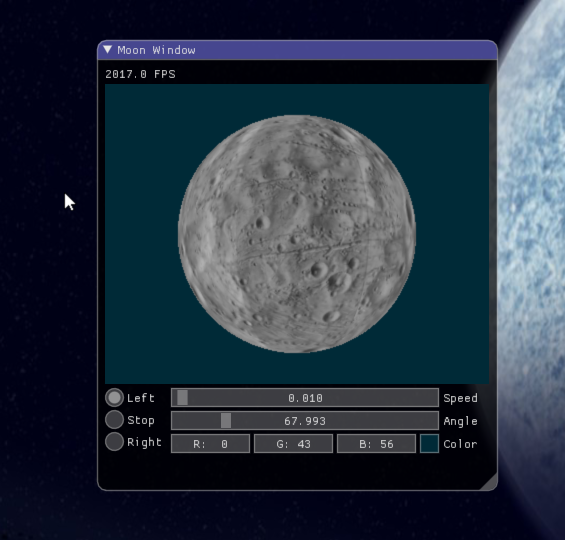
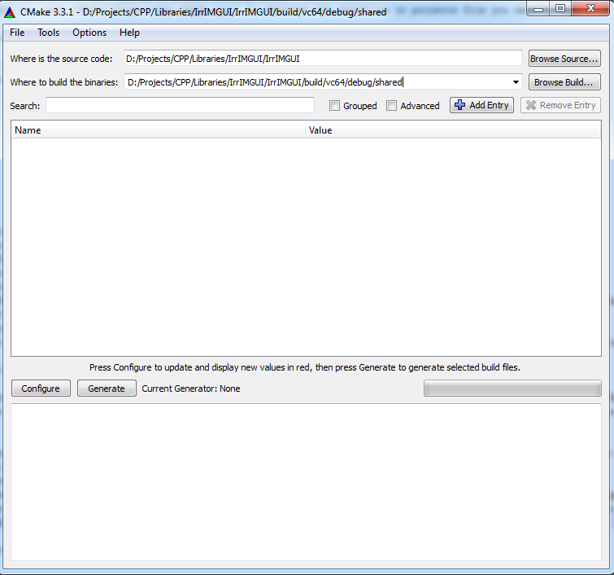
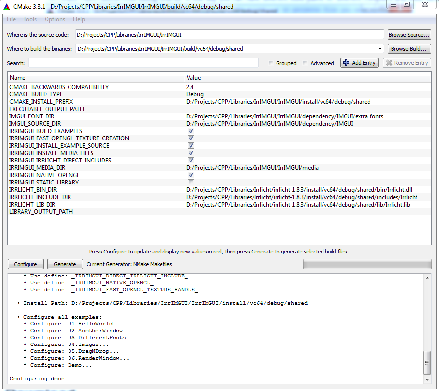

# Irrlicht Binding for IMGUI

## Index

* [Introduction](#Introduction)
* [Latest Version News](#LatestVersionNews)
* [Example Images](#ExampleImages)
* [How to Start](#HowToStart)
 * [Preparations](#HowToStart_Preparations)
 * [Embed IrrIMGUI into your Application](#HowToStart_ApplicationEmbedded)
 * [Build the Library](#HowToStart_BuildTheLibrary)
 * [HelloWorld Example](#HowToStart_HelloWorldExample)
 * [Further Examples](#HowToStart_FurtherExamples)
 * [API Documentation](#HowToStart_APIDocumentation)
* [Version History](#VersionHistory)

## <a name="Introduction"></a>Introduction

The goal of IrrIMGUI is to provide a render engine for the IMGUI system that works together with Irrlicht.

* [Irrlicht](http://irrlicht.sourceforge.net/) is an easy to learn and very fast 3D graphic engine, that supports OpenGL and DirectX.
* [IMGUI](https://github.com/ocornut/imgui/) is an Immediate Mode GUI system, that allows users to draw complex GUI widgets very easily. Furthermore, I think it has a very nice and modern default graphic style.

Of course IMGUI is not as complex like CEGUI. But for small application it is the ideal solution to have a very potential user interface with just some lines of code. 
However if you need a complex user interface with scripted widgets and events, and a highly adaptable template system, you should use CEGUI instead. But take care, you will end up with much more code and dependencies.

Following Features are supported so far:
* An Irrlicht bases render engine, that uses high level Irrlicht functions to draw the GUI elements.
* A native OpenGL renderer for test purposes and as a fall-back solution.
* An out of the box working Event Receiver for Irrlicht to bind mouse and keyboard events to the GUI.
* The input event handling for IMGUI can be easily customized to bind new input devices like joystick and another key-types to the GUI.
* Full support for different TTF fonts and font sizes.
* Support for drawing Irrlicht Image objects (IImage) inside the GUI.
* Support for drawing Irrlicht Texture objects (ITextrue) inside the GUI (thus you can render 3D content directly into GUI elements).

## <a name="LatestVersionNews"></a>Latest Version

### Upcomming: master-branch (unstable not tested yet)

#### Highlights
* nothing planned

#### Fixes
* nothing planned

#### Dependency Versions
* [IMGUI 1.45](https://github.com/ocornut/imgui/tree/v1.45)
* [Irrlicht 1.8.3](http://irrlicht.sourceforge.net/2015/09/irrlicht-1-8-3-released/)
* Other versions may work as well, but they are not tested.


### 30.9.2015: Version 0.2.0 ([Download Source](https://github.com/ZahlGraf/IrrIMGUI/archive/v0.2.0.zip)) ([Download Binaries](http://irrimgui.netzeband.eu/binaries/irrimgui_v0.2.0.zip))

#### Highlights
* Added Irrlicht High Level Renderer.
* **Note:** The Irrlicht High Level Renderer supports Irrlicht OpenGL and DirectX9 driver. DirectX8 is untested so far and the software render driver are missing necessary features (drawing primitives).

#### Fixes
* Created GUI Handle object in all examples with `new` to be able to destroy it before Irrlicht Driver is dropped. 
* **Attention:** Look at the new examples! Take care, that you destory your GUI Handle object _before_ destroying the Irrlicht Device. Otherwise your application will crash, when IrrIMGUI tries to free-up allocated memory.

#### Dependency Versions
* [IMGUI 1.45](https://github.com/ocornut/imgui/tree/v1.45)
* [Irrlicht 1.8.3](http://irrlicht.sourceforge.net/2015/09/irrlicht-1-8-3-released/)
* Other versions may work as well, but they are not tested.

#### Tested Build Variants
* Visual C++ 2015 (64bit): debug, static library
* Visual C++ 2015 (64bit): debug, shared library
* Visual C++ 2015 (64bit): release, static library
* Visual C++ 2015 (64bit): release, shared library
* Visual C++ 2015 (32bit): debug, static library
* Visual C++ 2015 (32bit): debug, shared library
* Visual C++ 2015 (32bit): release, static library
* Visual C++ 2015 (32bit): release, shared library
* MinGW (32bit): debug, static library
* MinGW (32bit): debug, shared library
* MinGW (32bit): release, static library
* MinGW (32bit): release, shared library
* MinGW (64bit): debug, static library
* MinGW (64bit): debug, shared library
* MinGW (64bit): release, static library
* MinGW (64bit): release, shared library
* Intel 16.0 (with MSVC 2015) (64bit, Win7): debug, static library
* Intel 16.0 (with MSVC 2015) (64bit, Win7): debug, shared library
* Intel 16.0 (with MSVC 2015) (64bit, Win7): release, static library
* Intel 16.0 (with MSVC 2015) (64bit, Win7): release, shared library
* GCC (64bit, Linux): debug, static library
* GCC (64bit, Linux): debug, shared library
* GCC (64bit, Linux): release, static library
* GCC (64bit, Linux): release, shared library
* Visual C++ 2015 (64bit - native OpenGL GUI renderer): debug, shared library
* MinGW (32bit - native OpenGL GUI renderer): release, static library
* GCC (64bit, Linux - native OpenGL GUI renderer): release, shared library

## <a name="ExampleImages"></a>Example Images
A picture is worth a thousand Words. So I will show you some examples:

This is a simple control interface created with IMGUI (example program 02.AnotherWindow).




IMGUI supports also TTF fonts (example program 03.DifferentFonts).




With the Irrlicht IMGUI binding you can draw every IImage object to the GUI (example program 05.DragNDrop).




You can also draw a render target texture to the GUI (example program 06.RenderWindow).



## <a name="HowToStart"></a> How to Start

### <a name="HowToStart_Preparations"></a> Preparations

* You need a compiled [Irrlicht](http://irrlicht.sourceforge.net/) library. Please test with the Irrlicht examples, if the library works as expected.
* Download the Irrlicht IMGUI binding (IrrIMGUI): [Download](#LatestVersion)
* Download the latest version of [IMGUI](https://github.com/ocornut/imgui/) and copy all files from the ZIP into the directory `<IrrIMGUI-Path>/dependency/IMGUI`
  The IrrIMGUI and IMGUI files are compiled together to a single shared or static library file. 
* When you want to compile IrrIMGUI as library, you need [CMake](http://www.cmake.org/) to generate the makefiles or project file you want to use

### <a name="HowToStart_ApplicationEmbedded"></a> Possibility 1: Embed IrrIMGUI into your Application

There are two ways how you can use IrrIMGUI. The first way is to embed all source files into your application and build it together with your project. 
* For this you simply need to create the following directory structure in your project:

```
 <Your-Project-Path>/
 + lib_includes/
 |+ IMGUI/
 |+ IrrIMGUI/
 + lib_source/
 |+ IrrIMGUI/
```

* Copy the source files from `<IrrIMGUI-Path>/source` to `<Your-Project-Path>/lib_source/IrrIMGUI`

* Copy the header files from `<IrrIMGUI-Path>/includes/IrrIMGUI` to `<Your-Project-Path>/lib_includes/IrrIMGUI`

* Copy the *.cpp and *.h files from `<IrrIMGUI-Path>/dependency/IMGUI` to `<Your-Project-Path>/lib_includes/IMGUI`

* Setup the path `<Your-Project-Path>/lib_includes/` as include search directory

* Setup the preprocessor defines to compile IrrIMGUI as static library (`_IRRIMGUI_STATIC_LIB_`)

* Setup the preprocessor define `_IRRIMGUI_SUBDIR_IRRLICHT_INCLUDE_` if your project includes Irrlicht like `#include <Irrlicht/irrlicht.h>` and not like `#include <irrlicht.h>`

* Setup the following preprocessor defines if you want:

 * `_IRRIMGUI_NATIVE_OPENGL_` to use the native OpenGL driver instead of the Irrlicht driver (test and fall-back solution)
 
 * `_IRRIMGUI_FAST_OPENGL_TEXTURE_HANDLE_` to use in the native OpenGL driver a dirty but very fast hack to determine the OpenGL texture ID from an ITexture object (this feature might be broken for other Irrlicht versions than the tested one)

### <a name="HowToStart_BuildTheLibrary"></a> Possibility 2: Build the Library

The second way is to build a shared or static library. This library will contain the Irrlicht IMGUI binding and the IMGUI System. The build tool CMake supports a build on many different platforms and with many different compilers.
You can use CMake from command line or - more convenient for an individual configuration - with a graphical user interface called cmake-gui. I will explain the cmake-gui build process to you, since I expect that the CMake command line tools are anyway for experts that know
how to build a library with CMake.

* Start a command shell with a proper compiler setup and with the CMake binary directory inside your path variable (Visual Studio for example has a batch file that setups all variables and paths for your compiler: e.g. `VsDevCmd.bat`).

* Goto your IrrIMGUI directory and start the program `cmake-gui`

* At top of the CMake GUI window you can enter two paths "Where is the source code" and "Where to build the binary"

 * Enter in the first text field "Where is the source code" the path to the IrrIMGUI library (the root directory of this library where also CMakeLists.txt is located)
 
 * Enter in the second text field "Where to build the binary" the path where the temporary build files should be stored. For example `<IrrIMGUI-Path>/build/vc64/debug/shared` In this way you can have different build paths for different compilers and build variants. 

 

 
* Now click on "Configure" and select your compiler options:

 * For Visual Studio (command line build) select "NMake Makefiles" and "Use default native compilers"
 * For MingW select "MSYS Makefile" and "Use default native compilers"
 * You can also create a Visual Studio or Eclipse Project file to compile the library (I have not tested this so far). 
 
 

 
* Click on finish. Now CMake does some analysis of your environment. In the end some red error messages are displayed, since you first need to specify the Irrlicht path.

* All variables that are new are printed with a red background color. Setup at least the following variables: 

 * _CMAKE_BUILD_TYPE_ = [Debug|Release] specify here if you want to build a debug or release library.
 
 * _CMAKE_INSTALL_PREFIX_ = <Install-Path> specify here the path where cmake should copy the compiled files (e.g. `<IrrIMGUI-Path>/install/vc64/debug/shared`).
 
 * _IRRLICHT_BIN_DIR_ = <path-to-irrlicht-shared-lib> specify here the path to the Irrlicht DLL or shared library
 
 * _IRRLICHT_LIB_DIR_ = <path-to-irrlicht-shared-lib> specify here the path to the Irrlicht link library or static library
 
 * _IRRLICHT_INCLUDE_DIR_ = <path-to-irrlicht-shared-lib> specify here the path to the Irrlicht headers
 
* **(Optional)** Setup the options you need for your individual build:
 * _IRRIMGUI_BUILD_EXAMPLE_ = [On|Off] enable this option to build also the example programs.  
 
 * _IRRIMGUI_INSTALL_EXAMPLE_SOURCES_ = [On|Off] enable this if you want to copy the source files for the examples also to the binary directory.   
 
 * _IRRIMGUI_INSTALL_MEDIA_FILES_ = [On|Off] you should enable this, when you want to use the examples out of the box. Otherwise the examples would miss the media files and will not run.  
 
 * _IRRIMGUI_IRRLICHT_DIRECT_INCLUDES_ = [On|Off] enable this option when you include your Irrlicht headers with `#include <irrlicht.h>` instead of `#include <Irrlicht/irrlicht.h>`  
 
 * _IRRIMGUI_NATIVE_OPENGL_ = [On|Off] enable this option only for tests or as fallback solution. The native OpenGL renderer is not officially supported.   
 
 * _IRRIMGUI_STATIC_LIBRARY_ = [On|Off] enable this if you want to compile IrrIMGUI as static library. **Attention: In this case you also need a static Irrlicht library!**
  
  

 
* Afterwards click again on "Configure". Now all error messages should be gone away. You should also see in the text-output a summary of your build-configuration.

* Click on "Generate" to create the makefiles or project files for your build. 

* Now you can start you build. Change in the command line to your build directory (the one you specified in the second text file of the CMake GUI e.g. `<IrrIMGUI-Path>/build/vc64/debug/shared`)

* Start the build on command line by:

 * Visual Studio: `nmake`
 * MingW: `make`
 
* **(Optional)** If [Doxygen](http://www.stack.nl/~dimitri/doxygen/) and [DOT/Graphviz](http://www.graphviz.org/) are installed at your computer, you can also build a documentation by:

 * Visual Studio: `nmake doc`
 * MingW: `make doc`
 
* At the end install your library files by:

 * Visual Studio: `nmake install` 
 * MingW: `make install`

### <a name="HowToStart_HelloWorldExample"></a> HelloWorld Example

The HelloWorld example builds up a simple scene with Irrlicht (I expect that you have some experience with Irrlicht. If not, please look first at the Irrlicht Tutorial). Furthermore it draws a simple IMGUI window with some text and an Exit-button.
The full source code can be found in the file [examples/01.HelloWorld/main.cpp](https://github.com/ZahlGraf/IrrIMGUI/blob/master/examples/01.HelloWorld/main.cpp). In this description, I will simply highlight the IMGUI specific code.

* **Include the IrrIMGUI main header:** Include the file `IrrIMGUI/IrrIMGUI.h` to your project.
```cpp
#include <IrrIMGUI/IrrIMGUI.h>
#include <IrrIMGUI/IncludeIrrlicht.h>
```

* **Setup the Irrlicht device:** When you setup the Irrlicht device, you can use the build in IrrIMGUI EventReceiver class to pass your Mouse and Keyboard events directly to the GUI.
```cpp
  using namespace irr;
  using namespace IrrIMGUI;

  // Irrlicht OpenGL Settings
  SIrrlichtCreationParameters IrrlichtParams;
  IrrlichtParams.DriverType    = video::EDT_OPENGL;
  IrrlichtParams.WindowSize    = core::dimension2d<u32>(1024, 800);
  IrrlichtParams.Bits          = 32;
  IrrlichtParams.Fullscreen    = false;
  IrrlichtParams.Stencilbuffer = true;
  IrrlichtParams.AntiAlias     = 16;
  IrrlichtParams.Vsync         = false;
  
  // Create standard event receiver for the IrrIMGUI
  CIMGUIEventReceiver EventReceiver;  
  IrrlichtParams.EventReceiver = &EventReceiver;

  // Create Irrlicht device
  IrrlichtDevice * const pDevice = createDeviceEx(IrrlichtParams);
```

* **Create a GUI object:** Before you can use the GUI system, you need to create a CGUIHandle object:
 The GUI handle needs a pointer to the Irrlicht device and to the event receiver, to be able to pass events to the GUI.
  **Attention:** It is very important to delete the GUI handle object _before_ you drop or delete the Irrlicht device. Otherwise you will get a memory access violation when the GUI handle frees up the internal memory and tries to use the Irrlicht device for that.
```cpp
  // Create GUI object
  CIMGUIHandle * const pGUI = new CIMGUIHandle(pDevice, &EventReceiver);
```

* **Draw GUI elements to the screen:** You can create the GUI elements inside the main-loop after calling `pGUI->startGUI();`. This function prepares the GUI for the next frame and passes the state of Mouse and Keyboard to IMGUI. 
 Afterwards you can use the GUI element functions in the namespace `ImGui` to create the elements you need. You must create them inside the main-loop, otherwise you will not see them (see the concept of an immediate mode GUI).
 Before rendering the GUI elements, you first need to render your Irrlicht scene. Otherwise the GUI is behind your scene. Afterwards you can render the GUI with `pGUI->drawAll();`.
 ```cpp
  scene::ISceneManager * const pSceneManager = pDevice->getSceneManager();

  // TODO: build your Irrlicht scene here ...
  
  // add camera to the scene
  pSceneManager->addCameraSceneNode(0, core::vector3df(0, 0, 0), core::vector3df(0,0,5));
   
   // Start main loop
  while(pDevice->run())
  {
    pDriver->beginScene(true, true, irr::video::SColor(255,100,101,140));

	// create the GUI elements
    pGUI->startGUI();
    ImGui::Begin("My first Window");
    ImGui::Text("Hello World!");
    if (ImGui::Button("Exit", ImVec2(40, 20)))
    {
      pDevice->closeDevice();
    }
    ImGui::End();

	// render your scene
    pSceneManager->drawAll();
	
	// render the GUI
    pGUI->drawAll();

    pDriver->endScene();
  }

  // free up memory
  delete(pGUI);
  pDevice->drop();
 ```
 
* Compile and look at your first GUI element<br>


### <a name="HowToStart_FurtherExamples"></a>Further Examples

You can find further example descriptions inside the [Wiki](https://github.com/ZahlGraf/IrrIMGUI/wiki).

### <a name="HowToStart_APIDocumentation"></a>API Documentation

A full API description can be found inside the Doxygen [documentation](http://zahlgraf.github.io/IrrIMGUI/).
 
## <a name="VersionHistory"></a>Version History
### 27.9.2015: Version 0.1.0 ([Download Source](https://github.com/ZahlGraf/IrrIMGUI/archive/v0.1.0.zip)) ([Download Binaries](http://irrimgui.netzeband.eu/binaries/irrimgui_v0.1.0.zip))

#### Highlights
* OpenGL native driver
* Full multi-font support
* Full support for IImage, ITexture and Raw Image data

#### Dependency Versions
* [IMGUI 1.45](https://github.com/ocornut/imgui/tree/v1.45)
* [Irrlicht 1.8.3](http://irrlicht.sourceforge.net/2015/09/irrlicht-1-8-3-released/)
* Other versions may work as well, but they are not tested.

#### Tested Build Variants
* Visual C++ 2015 (64bit): debug, static library
* Visual C++ 2015 (64bit): debug, shared library
* Visual C++ 2015 (64bit): release, static library
* Visual C++ 2015 (64bit): release, shared library
* Visual C++ 2015 (32bit): debug, static library
* Visual C++ 2015 (32bit): debug, shared library
* Visual C++ 2015 (32bit): release, static library
* Visual C++ 2015 (32bit): release, shared library
* MinGW (32bit): debug, static library
* MinGW (32bit): debug, shared library
* MinGW (32bit): release, static library
* MinGW (32bit): release, shared library
* MinGW (64bit): debug, static library
* MinGW (64bit): debug, shared library
* MinGW (64bit): release, static library
* MinGW (64bit): release, shared library
* Intel 16.0 (with MSVC 2015) (64bit, Win7): debug, static library
* Intel 16.0 (with MSVC 2015) (64bit, Win7): debug, shared library
* Intel 16.0 (with MSVC 2015) (64bit, Win7): release, static library
* Intel 16.0 (with MSVC 2015) (64bit, Win7): release, shared library
* GCC (64bit, Linux): debug, static library
* GCC (64bit, Linux): debug, shared library
* GCC (64bit, Linux): release, static library
* GCC (64bit, Linux): release, shared library


